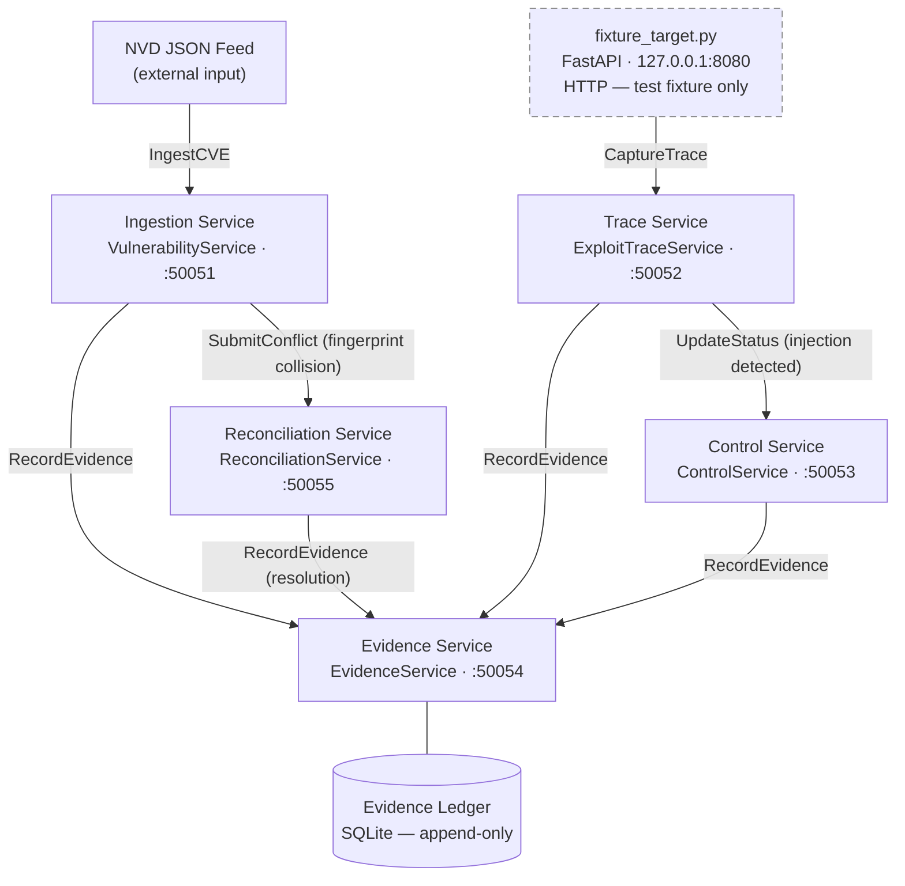

# icontrol-rce

<!-- 
Repository : bigip-icontrol-rce-research
Path       : README.md
Purpose    : Canonical entry document — architecture, data flow, operational runbook
Layer      : docs
SDLC Phase : all
ASVS Ref   : V15.1
OWASP Ref  : A04
Modified   : 2026-04-11
-->

> Structured SecDevOps research platform for CVE-2021-22986 lifecycle governance.  
> gRPC-native · OWASP ASVS L2 · Evidence-ledger backed · Fixture-only execution boundary.

This platform models CVE-2021-22986 — a CVSS 9.8 unauthenticated RCE in the F5 BIG-IP iControl REST API — as a structured data and governance problem, not an offensive tool. The PoC code from public disclosure is treated as an ingestion artefact: parsed into typed protobuf records, fingerprinted, deduplicated, and used as ASVS control verification test vectors. The execution boundary is absolute: `fixture_target.py` runs exclusively on `127.0.0.1`; no live F5 devices are contacted under any configuration.

      

---

## Architecture



> All inter-service communication is gRPC over Protocol Buffers v3. `fixture_target.py` is the only HTTP surface and is bound exclusively to `127.0.0.1`.

---

## Data Flow

An NVD JSON feed is ingested by the Ingestion service, which hydrates a `VulnerabilityRecord` protobuf, generates a SHA-256 fingerprint from canonical fields, and checks for duplicates. A fingerprint collision on differing fields is routed to the Reconciliation service, which applies a configured resolution strategy and appends a full audit trail entry. In parallel, the Trace service captures structured `ExploitTrace` records from the fixture target — both the token extraction path and the Basic auth bypass path modelled in the CVE — extracts the `utilCmdArgs` injection pattern, and triggers the relevant ASVS control in the Control service. Every state transition across all five services produces an evidence record with a content hash and lineage chain in the append-only SQLite ledger.

---

## Repository Map

```
bigip-icontrol-rce-research/
├── proto/               # Protobuf contract definitions — source of truth for all service APIs
├── generated/           # Auto-generated gRPC stubs — do not edit, committed for reproducibility
├── services/
│   ├── ingestion/       # CVE data ingest, deduplication, fingerprinting
│   ├── trace/           # Exploit trace capture, fixture target, replay
│   ├── control/         # ASVS control registry, OWASP crosswalk
│   ├── evidence/        # Evidence generation, SHA-256 ledger, lineage
│   └── reconciliation/  # Cross-service conflict detection and resolution
├── sdlc/
│   ├── requirements/    # STRIDE threat model, ASVS requirements mapping
│   ├── design/          # Architecture doc, control design decisions
│   ├── implementation/  # Changelog
│   ├── verification/    # Test plan, ASVS test matrix CSV, evidence export
│   └── release/         # Release gate checklist
├── tests/
│   ├── unit/            # Per-module, no network
│   ├── integration/     # Full pipeline harness against docker-compose stack
│   ├── fixtures/        # Serialised protobuf test vectors
│   └── asvs/            # ASVS control verification tests, tagged by ID
├── scripts/             # Operational scripts invoked by Makefile targets
├── docs/                # Extended documentation — see docs/README.md
└── .github/             # CI workflow definitions
```

---

## Prerequisites

| Tool | Minimum | Notes |
|------|---------|-------|
| Python | 3.12 | Service layer and test harness |
| Node.js | 20.x | JS/TS stub generation, npm toolchain |
| Docker | 24.x | Service orchestration |
| docker compose | 2.x | `docker compose`, not `docker-compose` |
| protoc | 25.x | Protocol Buffers compiler |
| make | 4.x | Build and operations entrypoint |

Python and Node dependency manifests: [`requirements.txt`](./requirements.txt) · [`requirements-dev.txt`](./requirements-dev.txt) · [`package.json`](./package.json)

Full build documentation: [`docs/build.md`](./docs/build.md)

---

## Build

```bash
git clone https://github.com/<org>/bigip-icontrol-rce-research
cd bigip-icontrol-rce-research

# verify prerequisites
make verify-tools && npm run verify:tools

# install
python3.12 -m venv .venv && source .venv/bin/activate
pip install -r requirements.txt -r requirements-dev.txt
npm ci

# compile proto stubs (both pipelines)
make proto
npm run build

# audit before starting services
make audit && npm run audit:deps && npm run audit:licenses

# start
make services-detach
```

**Port map**

| Service | Port | Bind | Protocol |
|---------|------|------|----------|
| Ingestion | 50051 | 0.0.0.0 | gRPC |
| Trace | 50052 | 0.0.0.0 | gRPC |
| Control | 50053 | 0.0.0.0 | gRPC |
| Evidence | 50054 | 0.0.0.0 | gRPC |
| Reconciliation | 50055 | 0.0.0.0 | gRPC |
| fixture_target | 8080 | 127.0.0.1 | HTTP |

---

## Testing

```bash
make test              # unit + integration, coverage to terminal
make asvs              # ASVS control verification, exports asvs_test_matrix.csv
make audit             # pip-audit, hard fail on CVSS >= 7.0
```

Unit tests: pure protobuf in/out, no network. Integration tests: full pipeline via gRPC client harness against the docker-compose stack using serialised test vectors. ASVS tests: tagged `@pytest.mark.asvs("V{n}.{m}.{k}")`, each mapped to a named entry in `owasp_control_matrix.csv`.

---

## OWASP Top 10 / ASVS Coverage

> Generated from `owasp_control_matrix.csv` via `make readme`. Do not edit directly.

| OWASP | ASVS | Implementation | Status |
|-------|------|----------------|--------|
| A01 Broken Access Control | V4.1.1 | `services/trace/server.py` — fixture URL allowlist at gRPC interceptor | ✅ |
| A02 Cryptographic Failures | V9.2.1 | `docker-compose.yml` — TLS on gRPC channels | 🔄 |
| A03 Injection | V5.2.3 | `services/trace/capture.py` — utilCmdArgs negative test vector | ✅ |
| A04 Insecure Design | V1.1.1 | `sdlc/requirements/threat_model.md` — STRIDE integrated into design | ✅ |
| A05 Security Misconfiguration | V14.4.1 | `docker-compose.yml` — internal network, localhost-only fixture bind | ✅ |
| A06 Vulnerable Components | V14.2.1 | `requirements.txt` — pip-audit hard gate CVSS ≥ 7.0 | ✅ |
| A07 Auth Failures | V2.1.1 | `services/trace/capture.py` — both CVE auth paths as trace vectors | ✅ |
| A08 Software Integrity | V10.2.1 | `services/evidence/hasher.py` — SHA-256 on every evidence record | ✅ |
| A09 Logging Failures | V7.1.1 | `services/evidence/ledger.py` — append-only SQLite, no silent failures | ✅ |
| A10 SSRF | V10.3.2 | `services/trace/server.py` — regex allowlist at gRPC method entry | ✅ |

---

## SDLC Artefact Map

| Phase | Artefact | Path | Generation |
|-------|----------|------|------------|
| Requirements | STRIDE threat model | `sdlc/requirements/threat_model.md` | Manual |
| Requirements | ASVS requirements | `sdlc/requirements/asvs_requirements.csv` | Manual |
| Design | Architecture doc | `sdlc/design/architecture.md` | Manual |
| Design | Control design | `sdlc/design/control_design.md` | Manual |
| Implementation | Changelog | `sdlc/implementation/CHANGELOG.md` | Per commit |
| Verification | Test plan | `sdlc/verification/test_plan.md` | Manual |
| Verification | ASVS test matrix | `sdlc/verification/asvs_test_matrix.csv` | `make asvs` |
| Verification | Evidence export | `sdlc/verification/evidence_ledger_export.json` | `make evidence-export` |
| Release | Gate checklist | `sdlc/release/release_checklist.md` | `make release` |

---

## Evidence Gap Register

Tracked in [`evidence_gap_register.csv`](./evidence_gap_register.csv). Append-only via `EvidenceService` — manual edits are rejected at the reconciliation layer. CRITICAL items block `make release`. HIGH items warn at `make asvs`.

---

## Out Of Scope

It does not execute code against live F5 BIG-IP devices under any configuration.
It does not ship, wrap, or republish offensive tooling — the CVE-2021-22986 PoC exists only as a parsed test vector in `tests/fixtures/`.
It is not a SIEM integration, alert triage platform, or continuous monitoring service.

---

## Reference

**Makefile**

```
make proto             .proto → Python stubs
make services          docker compose up
make services-detach   docker compose up -d
make services-down     docker compose down
make test              unit + integration
make asvs              ASVS control verification
make audit             pip-audit, CVSS >= 7.0 gate
make lint              ruff + mypy
make evidence-export   ledger → sdlc/verification/
make release           full gate: asvs + audit + gap register
make clean             containers, stubs, coverage
```

**npm**

```
npm run build          proto:gen → lint → proto:check
npm run audit:deps     npm audit, high severity gate
npm run audit:licenses permissive licence allowlist
npm run clean          remove generated/js and generated/ts
```

---


## Attribution and References

CVE-2021-22986 was discovered by William McVey and Andrew Williams and reported through the F5 Security Response Team. This platform was built for SecDevOps research and ASVS control verification purposes.

| Resource | URL |
|----------|-----|
| NVD entry | https://nvd.nist.gov/vuln/detail/CVE-2021-22986 |
| F5 advisory | https://support.f5.com/csp/article/K03009991 |
| OWASP ASVS | https://owasp.org/www-project-application-security-verification-standard/ |
| OWASP Top 10 | https://owasp.org/www-project-top-ten/ |
