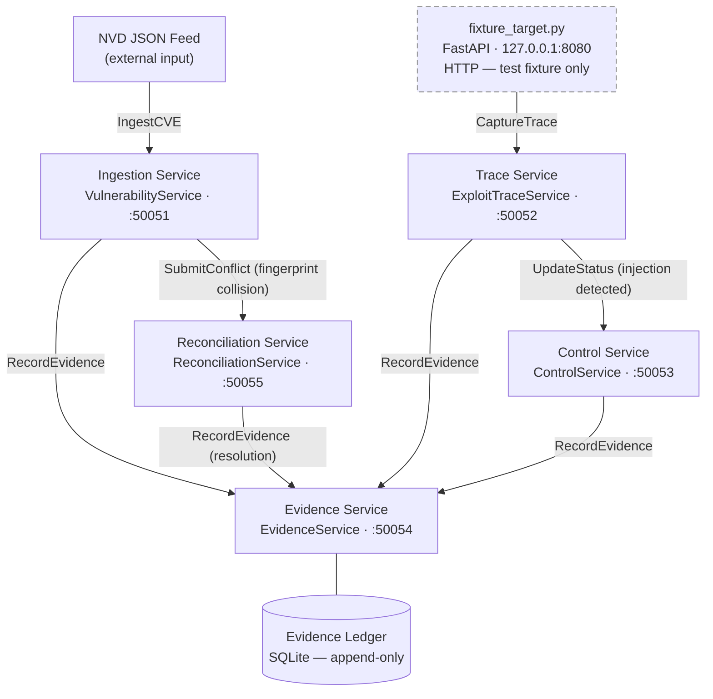

# bigip-icontrol-rce-research

<!-- 
Repository : bigip-icontrol-rce-research
Path       : README.md
Purpose    : Canonical entry document — architecture, data flow, operational runbook
Layer      : docs
SDLC Phase : all
ASVS Ref   : V15.1
OWASP Ref  : A04
Modified   : 2026-04-11
-->

> Structured SecDevOps research platform for CVE-2021-22986 lifecycle governance.  
> gRPC-native · OWASP ASVS L2 · Evidence-ledger backed · Fixture-only execution boundary.

This platform models CVE-2021-22986 — a CVSS 9.8 unauthenticated RCE in the F5 BIG-IP iControl REST API — as a structured data and governance problem, not an offensive tool. The PoC code from public disclosure is treated as an ingestion artefact: parsed into typed protobuf records, fingerprinted, deduplicated, and used as ASVS control verification test vectors. The platform's purpose is to demonstrate control implementation, evidence lineage, and SDLC discipline against a real critical-severity CVE. The execution boundary is absolute: `fixture_target.py` runs exclusively on `127.0.0.1`; no live F5 devices are contacted under any configuration.

      

---

## Architecture



> All inter-service communication is gRPC over Protocol Buffers v3. `fixture_target.py` is the only HTTP surface and is bound exclusively to `127.0.0.1`.

---

## Data Flow

An NVD JSON feed is ingested by the Ingestion service, which hydrates a `VulnerabilityRecord` protobuf, generates a SHA-256 fingerprint from canonical fields, and checks for duplicates. A clean record is written and an evidence entry is created. A fingerprint collision on differing fields is routed to the Reconciliation service, which applies a configured resolution strategy and appends a full audit trail entry. In parallel, the Trace service captures structured `ExploitTrace` records from the fixture target — both the token extraction path and the Basic auth bypass path modelled in the CVE — extracts the `utilCmdArgs` injection pattern, and triggers the relevant ASVS control in the Control service. Every state transition across all five services produces an evidence record with a content hash and lineage chain in the append-only SQLite ledger.

---

## Repository Map

```
bigip-icontrol-rce-research/
├── proto/               # Protobuf contract definitions — source of truth for all service APIs
├── generated/           # Auto-generated gRPC stubs — do not edit, committed for reproducibility
├── services/            # gRPC service implementations
│   ├── ingestion/       # CVE data ingest, deduplication, fingerprinting
│   ├── trace/           # Exploit trace capture, fixture target, replay
│   ├── control/         # ASVS control registry, OWASP crosswalk
│   ├── evidence/        # Evidence generation, SHA-256 ledger, lineage
│   └── reconciliation/  # Cross-service conflict detection and resolution
├── sdlc/                # SDLC phase artefacts — requirements through release
│   ├── requirements/    # STRIDE threat model, ASVS requirements mapping
│   ├── design/          # Architecture doc, control design decisions
│   ├── implementation/  # Changelog, implementation notes
│   ├── verification/    # Test plan, ASVS test matrix CSV, evidence export
│   └── release/         # Release gate checklist
├── tests/               # All test code — unit, integration, ASVS-tagged
│   ├── unit/            # Per-module unit tests, no network
│   ├── integration/     # Full pipeline integration harness
│   ├── fixtures/        # Serialised protobuf test vectors
│   └── asvs/            # ASVS control verification tests, tagged by ID
├── scripts/             # Operational scripts invoked by Makefile targets
├── docs/                # Extended documentation not suitable for README inline
└── .github/             # CI workflow definitions
```

---

## Prerequisites

### System Requirements

| Tool | Minimum Version | Notes |
|------|----------------|-------|
| Python | 3.12 | Service layer and test harness |
| Node.js | 20.x | Optional — JS/TS stub generation only |
| Docker | 24.x | Service orchestration |
| docker compose | 2.x | v2 syntax — `docker compose`, not `docker-compose` |
| protoc | 25.x | Protocol Buffers compiler |
| make | 4.x | Build and operations entrypoint |

### Python Dependencies

```
# requirements.txt — runtime (all versions pinned via pip-compile)
grpcio==1.62.1
grpcio-tools==1.62.1
protobuf==4.25.3
fastapi==0.110.1          # fixture_target.py only
uvicorn==0.29.0           # fixture_target.py only
sqlalchemy==2.0.29        # evidence ledger
pydantic==2.6.4
```

```
# requirements-dev.txt — test and tooling
pytest==8.1.1
pytest-asyncio==0.23.6
pytest-cov==5.0.0
ruff==0.4.1
mypy==1.9.0
pip-audit==2.7.3
grpcio-testing==1.62.1
```

### Node Dependencies

`package.json` is a first-class build artefact, not an optional appendage. It owns the proto compilation pipeline for JS/TS stubs, the lint and format toolchain, and the npm lifecycle hooks that coordinate with `make` targets.

```json
{
  "name": "bigip-icontrol-rce-research",
  "version": "0.1.0",
  "description": "SecDevOps research platform for CVE-2021-22986 lifecycle governance",
  "private": true,
  "engines": {
    "node": ">=20.0.0",
    "npm": ">=10.0.0"
  },
  "scripts": {
    "prebuild":        "npm run verify:tools",
    "build":           "npm run proto:gen && npm run lint",
    "postbuild":       "npm run proto:check",

    "proto:gen":       "scripts/proto_js.sh",
    "proto:check":     "node scripts/verify_proto_stubs.js",

    "lint":            "eslint 'scripts/**/*.{js,ts}' --max-warnings 0",
    "lint:fix":        "eslint 'scripts/**/*.{js,ts}' --fix",
    "format":          "prettier --write 'scripts/**/*.{js,ts,json}'",
    "format:check":    "prettier --check 'scripts/**/*.{js,ts,json}'",

    "verify:tools":    "node scripts/verify_tools.js",
    "verify:versions": "node scripts/verify_versions.js",

    "test":            "node --test scripts/**/*.test.js",
    "test:watch":      "node --test --watch scripts/**/*.test.js",

    "audit:deps":      "npm audit --audit-level=high",
    "audit:licenses":  "license-checker --onlyAllow 'MIT;Apache-2.0;BSD-2-Clause;BSD-3-Clause;ISC'",

    "clean":           "rimraf generated/js generated/ts",
    "clean:all":       "npm run clean && rimraf node_modules"
  },
  "devDependencies": {
    "@types/node":          "20.12.7",
    "eslint":               "9.1.1",
    "grpc-tools":           "1.12.4",
    "license-checker":      "25.0.1",
    "prettier":             "3.2.5",
    "protoc-gen-grpc-web":  "1.5.0",
    "rimraf":               "5.0.5",
    "ts-proto":             "1.169.0",
    "typescript":           "5.4.5"
  }
}
```

**Script lifecycle** — npm enforces a strict pre/post hook chain:

```
npm run build
  └── prebuild      → verify:tools     checks node, npm, protoc versions
  └── build         → proto:gen        compiles .proto → JS/TS stubs
                      lint             ESLint across scripts/
  └── postbuild     → proto:check      asserts all expected stub files exist
                                       and match proto service definitions
```

Running `npm run build` on a machine missing `protoc` or below Node 20 exits non-zero with a precise error message before any compilation is attempted.

**Outputs from `npm run proto:gen`**

```
generated/
├── js/                         # CommonJS stubs for Node gRPC clients
│   ├── vulnerability_v1_pb.js
│   ├── vulnerability_v1_grpc_pb.js
│   ├── exploit_trace_v1_pb.js
│   ├── exploit_trace_v1_grpc_pb.js
│   ├── control_v1_pb.js
│   ├── control_v1_grpc_pb.js
│   ├── evidence_v1_pb.js
│   ├── evidence_v1_grpc_pb.js
│   └── reconciliation_v1_pb.js
│   └── reconciliation_v1_grpc_pb.js
└── ts/                         # TypeScript definitions via ts-proto
    ├── vulnerability_v1.ts
    ├── exploit_trace_v1.ts
    ├── control_v1.ts
    ├── evidence_v1.ts
    └── reconciliation_v1.ts
```

These outputs are committed for reproducibility. `npm run clean` removes them; `npm run build` regenerates them. Do not edit generated files — change the `.proto` source.

**Dependency audit** — `npm run audit:deps` runs `npm audit` at `--audit-level=high`. `npm run audit:licenses` asserts that every transitive dependency uses a permissive licence from the allowlist above. Both are required to pass before `make release`.

---

## Build and Run

The build has two independent pipelines — Python (via `make`) and Node (via `npm`) — that share the proto source in `proto/` and converge in the docker-compose stack. Run them in the order below. Neither pipeline assumes the other has completed, but both must pass before `make services`.

### Step 1 — Clone and verify prerequisites

```bash
git clone https://github.com/<org>/bigip-icontrol-rce-research
cd bigip-icontrol-rce-research
make verify-tools      # checks python, docker, protoc
npm run verify:tools   # checks node, npm versions
```

Both checks must pass. They are independent — a failed `make verify-tools` does not prevent `npm run verify:tools` from running. Address each failure against the version floor table in Prerequisites.

### Step 2 — Install dependencies

```bash
# Python
python3.12 -m venv .venv
source .venv/bin/activate        # Windows: .venv\Scripts\activate
pip install -r requirements.txt
pip install -r requirements-dev.txt

# Node
npm ci                           # install from package-lock.json, not package.json
```

`npm ci` is required here, not `npm install`. It installs from the lockfile exactly, fails if `package-lock.json` is absent or inconsistent, and does not update it. This is the correct behaviour for a reproducible build.

### Step 3 — Compile protobuf stubs

```bash
make proto             # Python stubs → generated/*.py
npm run build          # JS/TS stubs → generated/js/ and generated/ts/
                       # also runs lint and proto:check
```

Both targets must complete without error before starting services. If either exits non-zero, the generated stubs are in an inconsistent state — do not proceed.

`npm run build` runs `proto:gen → lint → proto:check` in sequence via the pre/post hook chain. A lint failure stops the build before `proto:check` runs.

### Step 4 — Run dependency audits

```bash
make audit             # pip-audit, fail on CVSS >= 7.0
npm run audit:deps     # npm audit, fail on high severity
npm run audit:licenses # assert permissive licence allowlist
```

These are not optional steps before service startup — they are gates. A failing audit means a known vulnerable or non-compliant dependency is in the tree. Resolve it before proceeding.

### Step 5 — Start services

```bash
make services           # docker compose up, all gRPC services + fixture
make services-detach    # same, detached
make services-down      # tear down
```

**Port map**

| Service | Port | Bind | Protocol |
|---------|------|------|----------|
| Ingestion | 50051 | 0.0.0.0 | gRPC |
| Trace | 50052 | 0.0.0.0 | gRPC |
| Control | 50053 | 0.0.0.0 | gRPC |
| Evidence | 50054 | 0.0.0.0 | gRPC |
| Reconciliation | 50055 | 0.0.0.0 | gRPC |
| fixture_target | 8080 | 127.0.0.1 | HTTP |

The HTTP column on `fixture_target` is not a mistake. The fixture simulates the vulnerable iControl REST surface and does not terminate TLS because it is localhost-only and test-only. The `127.0.0.1` bind is enforced in `docker-compose.yml` and asserted in the fixture constraint test.

### Build state summary

Before running `make release`, the following must all be true:

```
make verify-tools      → exit 0
npm run verify:tools   → exit 0
make proto             → exit 0, generated/*.py present
npm run build          → exit 0, generated/js/ and generated/ts/ present
make audit             → exit 0, no findings CVSS >= 7.0
npm run audit:deps     → exit 0, no high/critical findings
npm run audit:licenses → exit 0, all licences in allowlist
make asvs              → exit 0, all ASVS tests passing
```

`make release` asserts all of these programmatically. It does not proceed past the first failure.

---

## Testing

### Run all tests

```bash
make test               # unit + integration, coverage to terminal
make test-coverage      # same, writes htmlcov/
```

### Run ASVS control verification only

```bash
make asvs
```

Output: `sdlc/verification/asvs_test_matrix.csv` — updated on every run. This file is the machine-readable control verification record and is not manually edited.

### Run security audit

```bash
make audit
```

Runs `pip-audit` against `requirements.txt`. Exits non-zero if any finding has CVSS ≥ 7.0. This is a hard gate, not advisory. `make release` depends on it.

### Test structure

Unit tests are pure protobuf in/out with no network and no subprocess. Integration tests run a full ingest → trace → evidence → reconciliation pipeline via a gRPC client harness against the docker-compose stack, using serialised test vectors from `tests/fixtures/`. ASVS tests are tagged `@pytest.mark.asvs("V{n}.{m}.{k}")` and map individually to entries in `owasp_control_matrix.csv`. The fixture constraint test asserts that `ExploitTraceService` rejects any `target_fixture_url` not matching `^https?://127\.|^https?://localhost` — this assertion runs on every CI push, not just during `make asvs`.

---

## OWASP Top 10 / ASVS Coverage

> Generated from `owasp_control_matrix.csv` via `make readme`. Do not edit this table directly.

| OWASP Category | ASVS Control | Implementation | Test | Status |
|---------------|-------------|----------------|------|--------|
| A01 Broken Access Control | V4.1.1 | `services/trace/server.py` — gRPC interceptor, fixture URL allowlist | `tests/asvs/test_a01_access_control.py` | ✅ Implemented |
| A02 Cryptographic Failures | V9.2.1 | `docker-compose.yml` — TLS on gRPC channels | `tests/asvs/test_a02_crypto.py` | 🔄 In Progress |
| A03 Injection | V5.2.3 | `services/trace/capture.py` — utilCmdArgs extraction and negative test | `tests/asvs/test_a03_injection.py` | ✅ Implemented |
| A04 Insecure Design | V1.1.1 | `sdlc/requirements/threat_model.md` — STRIDE model integrated into design | `tests/asvs/test_a04_design.py` | ✅ Implemented |
| A05 Security Misconfiguration | V14.4.1 | `docker-compose.yml` — internal network, no external port exposure | `tests/asvs/test_a05_misconfig.py` | ✅ Implemented |
| A06 Vulnerable Components | V14.2.1 | `requirements.txt` + `make audit` — pip-audit, CVSS ≥ 7.0 hard gate | `tests/asvs/test_a06_components.py` | ✅ Implemented |
| A07 Auth Failures | V2.1.1 | `services/trace/capture.py` — both auth paths modelled as trace vectors | `tests/asvs/test_a07_auth.py` | ✅ Implemented |
| A08 Software Integrity | V10.2.1 | `services/evidence/hasher.py` — SHA-256 on every evidence record | `tests/asvs/test_a08_integrity.py` | ✅ Implemented |
| A09 Logging Failures | V7.1.1 | `services/evidence/ledger.py` — append-only SQLite, no silent failures | `tests/asvs/test_a09_logging.py` | ✅ Implemented |
| A10 SSRF | V10.3.2 | `services/trace/server.py` — regex allowlist at gRPC method entry | `tests/asvs/test_a10_ssrf.py` | ✅ Implemented |

---

## SDLC Artefact Map

| Phase | Artefact | Path | Generation |
|-------|----------|------|------------|
| Requirements | STRIDE threat model | `sdlc/requirements/threat_model.md` | Manual, reviewed |
| Requirements | ASVS requirements CSV | `sdlc/requirements/asvs_requirements.csv` | Manual, reviewed |
| Design | Architecture document | `sdlc/design/architecture.md` | Manual, reviewed |
| Design | Control design decisions | `sdlc/design/control_design.md` | Manual, reviewed |
| Implementation | Changelog | `sdlc/implementation/CHANGELOG.md` | Maintained per commit |
| Verification | Test plan | `sdlc/verification/test_plan.md` | Manual, reviewed |
| Verification | ASVS test matrix CSV | `sdlc/verification/asvs_test_matrix.csv` | `make asvs` |
| Verification | Evidence ledger export | `sdlc/verification/evidence_ledger_export.json` | `make evidence-export` |
| Release | Release gate checklist | `sdlc/release/release_checklist.md` | `make release` |

---

## Evidence Gap Register

Open gaps are tracked in `evidence_gap_register.csv`. The register is append-only via `EvidenceService` — manual edits are rejected at the reconciliation layer. CRITICAL items block `make release`. HIGH items produce a warning at `make asvs`. Every item carries an owner, due date, ASVS reference, and status field.

Current open items: see [`evidence_gap_register.csv`](./evidence_gap_register.csv).

---

## What this repository does not do

It does not execute code against live F5 BIG-IP devices under any configuration.

It does not ship, wrap, or republish offensive tooling — the PoC code from CVE-2021-22986 public disclosure exists only as a parsed test vector in `tests/fixtures/`.

It is not a SIEM integration, alert triage platform, or continuous monitoring service.

---

## Makefile Reference

```
make proto             Compile .proto → Python stubs (generated/)
make proto-js          Compile .proto → JS/TS stubs (optional, requires Node)
make services          docker compose up all services
make services-detach   docker compose up -d
make services-down     docker compose down
make test              pytest unit + integration, coverage to terminal
make test-coverage     pytest with htmlcov/ output
make asvs              pytest -m asvs, export asvs_test_matrix.csv
make audit             pip-audit, fail on CVSS >= 7.0
make lint              ruff + mypy across services/ tests/ scripts/
make evidence-export   EvidenceService.ExportLedger → sdlc/verification/
make readme            Regenerate OWASP table from owasp_control_matrix.csv
make repo-map          Regenerate annotated directory tree in README
make verify-tools      Check python, docker, protoc versions
make release           Gate check: asvs + audit + gap register + clean tree
make clean             Remove containers, generated stubs, coverage artefacts
make help              Print this target list
```

## npm Script Reference

```
npm run build              prebuild → proto:gen → lint → postbuild (proto:check)
npm run proto:gen          Compile .proto → JS/TS stubs (generated/js, generated/ts)
npm run proto:check        Assert expected stub files exist and match proto definitions
npm run lint               ESLint across scripts/ — zero warnings tolerated
npm run lint:fix           ESLint with --fix
npm run format             Prettier write across scripts/
npm run format:check       Prettier check (used in CI)
npm run verify:tools       Check node and npm version floors
npm run verify:versions    Detailed version report for all tools
npm run test               node --test across scripts/**/*.test.js
npm run test:watch         Same, with --watch
npm run audit:deps         npm audit --audit-level=high
npm run audit:licenses     Assert permissive licence allowlist across all deps
npm run clean              Remove generated/js and generated/ts
npm run clean:all          Remove generated stubs + node_modules
```

---

## Attribution and References

CVE-2021-22986 was discovered by William McVey and Andrew Williams and reported through the F5 Security Response Team. This platform was built for SecDevOps research and ASVS control verification purposes.

| Resource | URL |
|----------|-----|
| NVD entry | https://nvd.nist.gov/vuln/detail/CVE-2021-22986 |
| F5 advisory | https://support.f5.com/csp/article/K03009991 |
| OWASP ASVS | https://owasp.org/www-project-application-security-verification-standard/ |
| OWASP Top 10 | https://owasp.org/www-project-top-ten/ |
