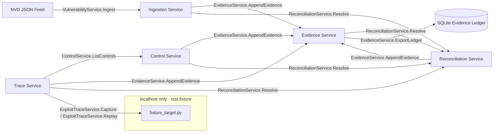

# bigip-icontrol-rce-research

<!--
Repository : bigip-icontrol-rce-research
Path       : README.md
Purpose    : Canonical entry document describing architecture, operations, and governance for the research platform
Layer      : docs
SDLC Phase : design
ASVS Ref   : V1.1.1, V15.1
OWASP Ref  : A04
Modified   : 2026-04-10
-->

> Structured SecDevOps research platform for CVE-2021-22986 lifecycle governance.
> gRPC-native · OWASP ASVS L2 · Evidence-ledger backed · Fixture-only execution boundary.

`bigip-icontrol-rce-research` models CVE-2021-22986 as a security engineering lifecycle problem where critical-vulnerability knowledge moves through typed contracts, verification controls, and immutable evidence records so teams can prove what they validated, when they validated it, and which control objective each result satisfies.


This platform serves application security engineers, product security teams, and secure SDLC program owners who need to turn a real critical CVE into repeatable governance artefacts. It treats public PoC material as ingestion input rather than an execution asset: parsers convert disclosed request structures into protobuf records, tests map those vectors to ASVS controls, and every lifecycle event emits evidence with lineage. The execution boundary stays fixed at `services/trace/fixture_target.py`, bound to `127.0.0.1`, and the project never targets live devices.



All inter-service communication is gRPC/protobuf. The fixture target is the only HTTP surface and is bound exclusively to `127.0.0.1`.

A full run starts when ingestion receives NVD-derived CVE data through `VulnerabilityService.Ingest`, computes a deterministic fingerprint, and records a deduplicated vulnerability event in evidence. Trace capture then records a fixture-bound request/response pair, extracts injection-relevant structure such as `utilCmdArgs`, and queries mapped controls. Control evaluation updates implementation status while EvidenceService writes a hashed record and lineage reference for each step. If any service submits conflicting values, ReconciliationService resolves the conflict by strategy and appends an audit event so downstream verification reports remain consistent.

## Prerequisites

### System requirements

```text
Python  ≥ 3.12     # type checking and project tooling target py312
Node.js ≥ 20.x     # optional JS/TS protobuf stub generation
Docker  ≥ 24.x     # compose stack runtime for service integration tests
docker-compose ≥ 2.x
protoc  ≥ 25.x     # required for make proto
make
```

### Python dependencies

```text
# requirements.txt — runtime
grpcio==1.68.1
grpcio-tools==1.68.1
protobuf==5.29.1
fastapi==0.115.0        # fixture_target.py only
uvicorn==0.32.0         # fixture_target.py only
sqlalchemy==2.0.36      # evidence ledger
pydantic==2.9.2

# requirements-dev.txt — test and tooling
pytest==8.3.4
pytest-asyncio==0.24.0
pytest-cov==6.0.0
ruff==0.8.2
mypy==1.13.0
pip-audit==2.7.3
grpcio-testing==1.68.1
```

### Node dependencies (optional, JS stub generation only)

```json
{
  "devDependencies": {
    "grpc-tools": "1.13.0",
    "protoc-gen-grpc-web": "1.5.0",
    "ts-proto": "2.1.0"
  },
  "scripts": {
    "proto:gen": "make proto-js"
  }
}
```

## Build and run

```bash
git clone https://github.com/<org>/bigip-icontrol-rce-research
cd bigip-icontrol-rce-research
make verify-tools
```

```bash
python -m venv .venv
source .venv/bin/activate        # Windows: .venv\Scripts\activate
pip install -r requirements.txt
pip install -r requirements-dev.txt
```

```bash
make proto
```

Invokes `protoc` across all `.proto` files in `proto/` and writes Python stubs to `generated/`; run this before starting services and run it again after every proto change.

```bash
make services
make services-detach
make services-down
```

| Service        | Port  | Bind      | Protocol |
|----------------|-------|-----------|----------|
| Ingestion      | 50051 | 0.0.0.0   | gRPC     |
| Trace          | 50052 | 0.0.0.0   | gRPC     |
| Control        | 50053 | 0.0.0.0   | gRPC     |
| Evidence       | 50054 | 0.0.0.0   | gRPC     |
| Reconciliation | 50055 | 0.0.0.0   | gRPC     |
| fixture_target | 8080  | 127.0.0.1 | HTTP     |

The fixture endpoint stays on HTTP by design because it is localhost-only and test-only.

## Verification workflow

```bash
make test
make test-coverage
```

```bash
make asvs
```

`make asvs` updates `sdlc/verification/asvs_test_matrix.csv` on every run; this file is the machine-readable control verification record.

```bash
make audit
```

`make audit` enforces a hard gate and exits non-zero for any known dependency vulnerability with CVSS score 7.0 or higher.

Unit tests exercise pure logic and protobuf-shape handling without network calls. Integration tests run a composed gRPC stack and replay serialized vectors through the complete path. ASVS tests carry control IDs that map to `owasp_control_matrix.csv`, and fixture-boundary tests enforce localhost-only targets (`^https?://127\.|^https?://localhost`) on every CI run.

## OWASP Top 10 / ASVS coverage

Generated from `owasp_control_matrix.csv` via `make readme`.

<!-- BEGIN:OWASP_TABLE -->

| OWASP Category | ASVS Control ID | Implementation | Test Coverage | Status |
|---|---|---|---|---|
| Broken Access Control | V4.1.1 | services/trace/server.py fixture URL validator | tests/asvs/test_asvs_controls.py | IMPLEMENTED |
| Cryptographic Failures | V9.2.1 | docker-compose.yml TLS config | tests/asvs/test_asvs_controls.py | IN_PROGRESS |
| Injection | V5.2.3 | services/trace/capture.py | tests/asvs/test_asvs_controls.py | IMPLEMENTED |
| Insecure Design | V1.1.1 | sdlc/requirements/threat_model.md | tests/asvs/test_asvs_controls.py | IMPLEMENTED |
| Security Misconfiguration | V14.4.1 | docker-compose.yml network config | tests/asvs/test_asvs_controls.py | IMPLEMENTED |
| Vulnerable Components | V14.2.1 | requirements.txt + make audit | tests/asvs/test_asvs_controls.py | IMPLEMENTED |
| Identification and Auth Failures | V2.1.1 | services/trace/capture.py auth parsing | tests/asvs/test_asvs_controls.py | IMPLEMENTED |
| Software Integrity | V10.2.1 | services/evidence/hasher.py | tests/asvs/test_asvs_controls.py | IMPLEMENTED |
| Logging Failures | V7.1.1 | services/evidence/ledger.py | tests/asvs/test_asvs_controls.py | IMPLEMENTED |
| SSRF | V10.3.2 | services/trace/server.py | tests/asvs/test_asvs_controls.py | IMPLEMENTED |

<!-- END:OWASP_TABLE -->


## SDLC artefact map

Regenerated by `make readme` using repository CSV sources.

<!-- BEGIN:SDLC_TABLE -->

| Phase | Artefact | Path | Status |
|---|---|---|---|
| Requirements | threat_model.md | sdlc/requirements/threat_model.md | Maintained |
| Design | architecture.md | sdlc/design/architecture.md | Maintained |
| Implementation | CHANGELOG.md | sdlc/implementation/CHANGELOG.md | Maintained |
| Verification | asvs_test_matrix.csv | sdlc/verification/asvs_test_matrix.csv | Generated |
| Release | release_checklist.md | sdlc/release/release_checklist.md | Maintained |

<!-- END:SDLC_TABLE -->


## Evidence gap register

Track open gaps in `evidence_gap_register.csv`. CRITICAL items block `make release`, HIGH items raise warnings in `make asvs`, every item includes owner and due date, and the register is append-only through EvidenceService with reconciliation enforcing manual-edit rejection.

## What this repository does not do

1. It does not execute code against live F5 BIG-IP devices under any configuration.
2. It does not ship, wrap, or republish offensive tooling; PoC material exists only as parsed test vectors.
3. It is not a SIEM integration, alert triage platform, or continuous monitoring service.

## Attribution and references

CVE-2021-22986 discovered by William McVey and Andrew Williams, reported through F5 Security Response Team.

- NVD entry: https://nvd.nist.gov/vuln/detail/CVE-2021-22986
- F5 advisory: https://support.f5.com/csp/article/K03009991
- ASVS: https://owasp.org/www-project-application-security-verification-standard/
- OWASP Top 10: https://owasp.org/www-project-top-ten/

## Makefile target reference

```text
make proto             Compile .proto → Python stubs (generated/)
make proto-js          Compile .proto → JS/TS stubs (optional)
make services          docker-compose up all services
make services-detach   docker-compose up -d
make services-down     docker-compose down
make test              pytest unit + integration, coverage to terminal
make test-coverage     pytest with htmlcov/ output
make asvs              pytest -m asvs, export asvs_test_matrix.csv
make audit             pip-audit, fail on CVSS ≥ 7.0
make lint              ruff + mypy
make evidence-export   EvidenceService.ExportLedger → sdlc/verification/
make readme            Regenerate OWASP and SDLC tables from CSV sources
make verify-tools      Check all prerequisites, exit non-zero if missing
make release           Gate check: asvs + audit + gap register + clean tree
make clean             Remove containers, generated stubs, coverage artefacts
```
