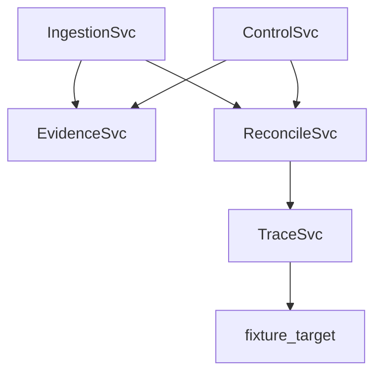

# bigip-icontrol-rce-research

Research harness for CVE-2021-22986 analysis with protobuf-first contracts, ASVS mappings, and append-only evidence controls.

## Architecture

## Contract Files

- [proto/vulnerability.proto](proto/vulnerability.proto)
- [proto/exploit_trace.proto](proto/exploit_trace.proto)
- [proto/control.proto](proto/control.proto)
- [proto/evidence.proto](proto/evidence.proto)
- [proto/reconciliation.proto](proto/reconciliation.proto)

## Service Files

- [services/ingestion/server.py](services/ingestion/server.py)
- [services/ingestion/parser.py](services/ingestion/parser.py)
- [services/ingestion/dedup.py](services/ingestion/dedup.py)
- [services/trace/server.py](services/trace/server.py)
- [services/trace/capture.py](services/trace/capture.py)
- [services/trace/fixture_target.py](services/trace/fixture_target.py)
- [services/trace/replay.py](services/trace/replay.py)
- [services/evidence/hasher.py](services/evidence/hasher.py)
- [services/evidence/ledger.py](services/evidence/ledger.py)
- [services/control/server.py](services/control/server.py)
- [services/control/asvs_loader.py](services/control/asvs_loader.py)
- [services/control/owasp_crosswalk.py](services/control/owasp_crosswalk.py)
- [services/reconciliation/server.py](services/reconciliation/server.py)
- [services/reconciliation/resolver.py](services/reconciliation/resolver.py)
- [services/reconciliation/audit_trail.py](services/reconciliation/audit_trail.py)

## Verification and SDLC

- [tests/fixtures/exploit_trace_vectors.json](tests/fixtures/exploit_trace_vectors.json)
- [tests/asvs/test_a01_access_control.py](tests/asvs/test_a01_access_control.py)
- [tests/asvs/test_a02_crypto.py](tests/asvs/test_a02_crypto.py)
- [tests/asvs/test_a03_injection.py](tests/asvs/test_a03_injection.py)
- [tests/asvs/test_a04_design.py](tests/asvs/test_a04_design.py)
- [tests/asvs/test_a05_security_config.py](tests/asvs/test_a05_security_config.py)
- [tests/asvs/test_a06_vulnerable_components.py](tests/asvs/test_a06_vulnerable_components.py)
- [tests/asvs/test_a07_auth.py](tests/asvs/test_a07_auth.py)
- [tests/asvs/test_a08_integrity.py](tests/asvs/test_a08_integrity.py)
- [tests/asvs/test_a09_logging.py](tests/asvs/test_a09_logging.py)
- [tests/asvs/test_a10_ssrf.py](tests/asvs/test_a10_ssrf.py)
- [sdlc/requirements/threat_model.md](sdlc/requirements/threat_model.md)
- [sdlc/requirements/asvs_requirements.csv](sdlc/requirements/asvs_requirements.csv)
- [sdlc/design/architecture.md](sdlc/design/architecture.md)
- [sdlc/design/control_design.md](sdlc/design/control_design.md)
- [sdlc/implementation/CHANGELOG.md](sdlc/implementation/CHANGELOG.md)
- [sdlc/verification/test_plan.md](sdlc/verification/test_plan.md)
- [sdlc/release/release_checklist.md](sdlc/release/release_checklist.md)

## Scripts

- [scripts/verify_tools.sh](scripts/verify_tools.sh)
- [scripts/verify_tools.js](scripts/verify_tools.js)
- [scripts/verify_proto_stubs.js](scripts/verify_proto_stubs.js)
- [scripts/export_asvs_matrix.py](scripts/export_asvs_matrix.py)
- [scripts/export_evidence.py](scripts/export_evidence.py)
- [scripts/release_gate.py](scripts/release_gate.py)
- [scripts/generate_readme_tables.py](scripts/generate_readme_tables.py)
