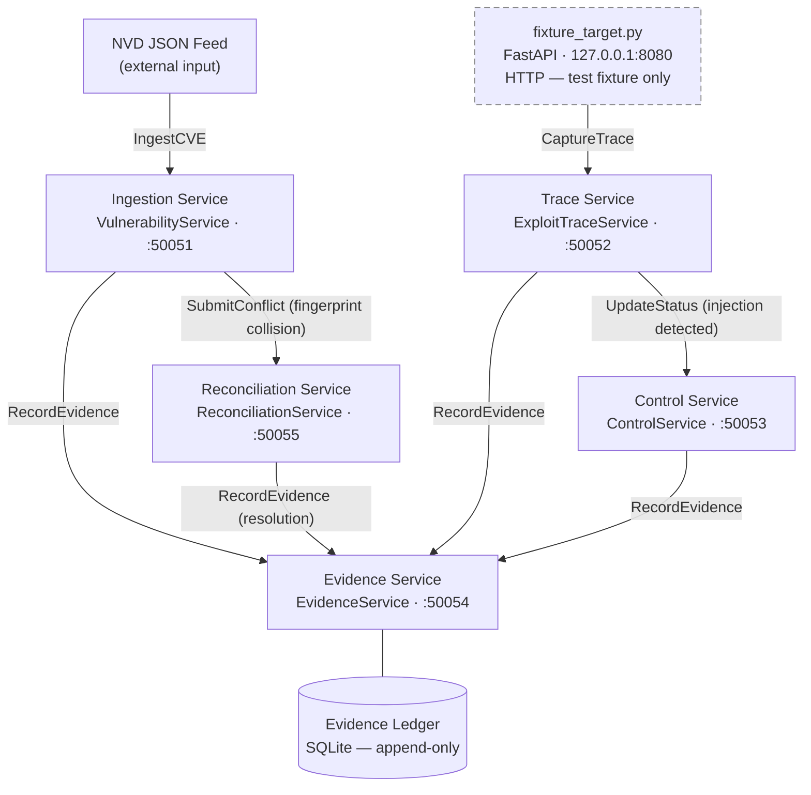

# bigip-icontrol-rce-research

<!-- 
Repository : bigip-icontrol-rce-research
Path       : README.md
Purpose    : Canonical entry document — architecture, data flow, operational runbook
Layer      : docs
SDLC Phase : all
ASVS Ref   : V15.1
OWASP Ref  : A04
Modified   : 2026-04-12
-->

> Structured SecDevOps research platform for CVE-2021-22986 lifecycle governance.  
> gRPC-native · OWASP ASVS L2 · Evidence-ledger backed · Fixture-only execution boundary.

This platform models CVE-2021-22986 — a CVSS 9.8 unauthenticated RCE in the F5 BIG-IP iControl REST API — as a structured data and governance problem, not an offensive tool. The PoC code from public disclosure is treated as an ingestion artefact: parsed into typed protobuf records, fingerprinted, deduplicated, and used as ASVS control verification test vectors. The execution boundary is absolute: `fixture_target.py` runs exclusively on `127.0.0.1`; no live F5 devices are contacted under any configuration.

      

---

## Architecture



> All inter-service communication is gRPC over Protocol Buffers v3. `fixture_target.py` is the only HTTP surface and is bound exclusively to `127.0.0.1`.

---

## Data Flow

An NVD JSON feed is ingested by the Ingestion service, which hydrates a `VulnerabilityRecord` protobuf, generates a SHA-256 fingerprint from canonical fields, and checks for duplicates. A fingerprint collision on differing fields is routed to the Reconciliation service, which applies a configured resolution strategy and appends a full audit trail entry. In parallel, the Trace service captures structured `ExploitTrace` records from the fixture target — both the token extraction path and the Basic auth bypass path modelled in the CVE — extracts the `utilCmdArgs` injection pattern, and triggers the relevant ASVS control in the Control service. Every state transition across all five services produces an evidence record with a content hash and lineage chain in the append-only SQLite ledger.

---

## CVE Attack Surface Model

The fixture models two request chains from CVE-2021-22986 as structured capture paths. Neither executes commands. Both produce [`ExploitTrace`](./proto/exploit_trace.proto) protobuf records that feed the ASVS test suite.

**Auth path A — token extraction**

```
POST /mgmt/shared/authn/login
Content-Type: application/json

{ "username": "admin", "loginReference": { "link": "/shared/gossip" } }

→ response contains selfLink token path
→ captured as ExploitTrace.token_extracted = true
```

**Auth path B — Basic bypass**

```
POST /mgmt/tm/util/bash
X-F5-Auth-Token: <empty>
Authorization: Basic <base64-encoded-credentials>
Content-Type: application/json

{ "command": "run", "utilCmdArgs": "-c <cmd>" }

→ utilCmdArgs value captured as ExploitTrace.command_injected
→ used as negative test vector in A03 injection control
```

Both paths are serialised in [`tests/fixtures/exploit_trace_vectors.json`](./tests/fixtures/exploit_trace_vectors.json) as four vectors: token extraction (path A), Basic bypass (path B), id recon (path A follow-on), and a non-localhost SSRF rejection negative case. The `command_injected` field carries `whoami` and `id` for pattern extraction only — the fixture returns static synthetic output and executes nothing. The header schema is defined in [`proto/exploit_trace.proto`](./proto/exploit_trace.proto) under `request_headers map<string, string>`.

| Capture element | Proto field | ASVS control | Test |
|----------------|-------------|--------------|------|
| Auth token extraction | `token_extracted` | V2.1.1 | [`test_a07_auth.py`](./tests/asvs/test_a07_auth.py) |
| Basic bypass header | `request_headers["Authorization"]` | V2.1.1 | [`test_a07_auth.py`](./tests/asvs/test_a07_auth.py) |
| `X-F5-Auth-Token` crafting | `request_headers["X-F5-Auth-Token"]` | V4.1.1 | [`test_a01_access_control.py`](./tests/asvs/test_a01_access_control.py) |
| `utilCmdArgs` injection pattern | `command_injected` | V5.2.3 | [`test_a03_injection.py`](./tests/asvs/test_a03_injection.py) |
| Fixture URL boundary enforcement | `target_fixture_url` | V10.3.2 | [`test_a10_ssrf.py`](./tests/asvs/test_a10_ssrf.py) |

---

## Repository Map

```
bigip-icontrol-rce-research/
├── proto/
│   ├── vulnerability.proto      # CVE record schema, CVSS fields, version ranges
│   ├── exploit_trace.proto      # Request/response capture, header map, injection field
│   ├── control.proto            # ASVS control registry, OWASP crosswalk
│   ├── evidence.proto           # SHA-256 artefact ledger, lineage chains
│   └── reconciliation.proto     # Conflict detection, resolution strategies, audit trail
├── generated/                   # Auto-generated gRPC stubs — do not edit
├── services/
│   ├── ingestion/
│   │   ├── server.py            # VulnerabilityService gRPC server
│   │   ├── parser.py            # NVD JSON → VulnerabilityRecord protobuf
│   │   ├── dedup.py             # SHA-256 fingerprint engine, collision detection
│   │   └── Dockerfile
│   ├── trace/
│   │   ├── server.py            # ExploitTraceService — gRPC server, URL allowlist interceptor
│   │   ├── capture.py           # Request serialiser → ExploitTrace protobuf
│   │   ├── fixture_target.py    # FastAPI stub — simulates iControl REST, 127.0.0.1 only
│   │   ├── replay.py            # Deterministic replay against fixture only
│   │   └── Dockerfile
│   ├── control/
│   │   ├── server.py            # ControlService gRPC server
│   │   ├── asvs_loader.py       # ASVS L2 manifest CSV → ControlRecord list
│   │   ├── owasp_crosswalk.py   # OWASP category → ASVS control ID mapping
│   │   └── Dockerfile
│   ├── evidence/
│   │   ├── server.py            # EvidenceService gRPC server
│   │   ├── hasher.py            # SHA-256 artefact fingerprinting
│   │   ├── ledger.py            # Append-only SQLite evidence ledger + audit trail schema
│   │   └── Dockerfile
│   └── reconciliation/
│       ├── server.py            # ReconciliationService gRPC server
│       ├── resolver.py          # LATEST_WINS / SOURCE_PRIORITY / MANUAL strategies
│       ├── audit_trail.py       # Append-only mutation history
│       └── Dockerfile
├── sdlc/
│   ├── requirements/
│   │   ├── threat_model.md      # STRIDE model — five categories, CVE attack paths
│   │   └── asvs_requirements.csv
│   ├── design/
│   │   ├── architecture.md      # Service topology, data lineage, dedup design
│   │   └── control_design.md    # Per-OWASP control decisions, implementation locations
│   ├── implementation/
│   │   └── CHANGELOG.md
│   ├── verification/
│   │   ├── test_plan.md
│   │   ├── asvs_test_matrix.csv         # Generated by make asvs
│   │   └── evidence_ledger_export.json  # Generated by make evidence-export
│   └── release/
│       └── release_checklist.md
├── tests/
│   ├── unit/
│   │   ├── test_ingestion_parser.py
│   │   ├── test_ingestion_dedup.py
│   │   ├── test_trace_capture.py
│   │   ├── test_evidence_hasher.py
│   │   └── test_reconciliation_resolver.py
│   ├── integration/
│   │   └── test_full_pipeline.py        # Requires docker-compose stack
│   ├── fixtures/
│   │   └── exploit_trace_vectors.json   # Four ExploitTrace vectors (3 positive, 1 negative)
│   └── asvs/
│       ├── test_a01_access_control.py   # V4.1.1
│       ├── test_a02_crypto.py           # V9.2.1
│       ├── test_a03_injection.py        # V5.2.3
│       ├── test_a04_design.py           # V1.1.1
│       ├── test_a05_misconfig.py        # V14.4.1
│       ├── test_a06_components.py       # V14.2.1
│       ├── test_a07_auth.py             # V2.1.1
│       ├── test_a08_integrity.py        # V10.2.1
│       ├── test_a09_logging.py          # V7.1.1
│       └── test_a10_ssrf.py             # V10.3.2
├── scripts/
│   ├── verify_tools.sh              # Checks python, docker, protoc version floors
│   ├── verify_tools.js              # Checks node, npm version floors
│   ├── verify_proto_stubs.js        # Asserts all _pb2.py stubs present in generated/
│   ├── proto_js.sh                  # Compiles .proto → JS/TS stubs
│   ├── export_asvs_matrix.py        # pytest results → asvs_test_matrix.csv
│   ├── export_evidence.py           # EvidenceService.ExportLedger → JSON file
│   ├── release_gate.py              # Asserts gap register and ASVS matrix pass conditions
│   └── generate_readme_tables.py    # Regenerates OWASP table in README from CSV
├── docs/
│   └── build.md                     # Full build pipeline documentation
├── owasp_control_matrix.csv
├── evidence_gap_register.csv
├── docker-compose.yml
├── Makefile
├── pyproject.toml
├── requirements.txt
├── requirements-dev.txt
├── package.json
└── .github/workflows/ci.yml
```

---

## Prerequisites

| Tool | Minimum | Notes |
|------|---------|-------|
| Python | 3.12 | Service layer and test harness |
| Node.js | 20.x | JS/TS stub generation, npm toolchain |
| Docker | 24.x | Service orchestration |
| docker compose | 2.x | `docker compose`, not `docker-compose` |
| protoc | 25.x | Protocol Buffers compiler |
| make | 4.x | Build and operations entrypoint |

Dependency manifests: [`requirements.txt`](./requirements.txt) · [`requirements-dev.txt`](./requirements-dev.txt) · [`package.json`](./package.json)

Full build documentation: [`docs/build.md`](./docs/build.md)

---

## Build

```bash
git clone https://github.com/<org>/bigip-icontrol-rce-research
cd bigip-icontrol-rce-research

# verify prerequisites
make verify-tools && npm run verify:tools

# install
python3.12 -m venv .venv && source .venv/bin/activate
pip install -r requirements.txt -r requirements-dev.txt
npm ci

# compile proto stubs (both pipelines)
make proto
npm run build

# audit before starting services
make audit && npm run audit:deps && npm run audit:licenses

# start
make services-detach
```

**Port map**

| Service | Port | Bind | Protocol |
|---------|------|------|----------|
| Ingestion | 50051 | 0.0.0.0 | gRPC |
| Trace | 50052 | 0.0.0.0 | gRPC |
| Control | 50053 | 0.0.0.0 | gRPC |
| Evidence | 50054 | 0.0.0.0 | gRPC |
| Reconciliation | 50055 | 0.0.0.0 | gRPC |
| fixture_target | 8080 | 127.0.0.1 | HTTP |

---

## Testing

```bash
make test              # unit + integration, coverage to terminal
make asvs              # ASVS control verification, exports asvs_test_matrix.csv
make audit             # pip-audit, hard fail on CVSS >= 7.0
```

**Unit tests** (`tests/unit/`) cover parser field mapping, fingerprint algorithm, capture serialisation, SHA-256 hasher, and all three resolution strategies. No network, no docker. **Integration tests** (`tests/integration/test_full_pipeline.py`) run the full ingest → trace → evidence → reconciliation pipeline against the live docker-compose stack using vectors from [`tests/fixtures/exploit_trace_vectors.json`](./tests/fixtures/exploit_trace_vectors.json). Requires `make services-detach` first. **ASVS tests** (`tests/asvs/`) are tagged `@pytest.mark.asvs("V{n}.{m}.{k}")`, one module per OWASP Top 10 category, each mapped to a named entry in [`owasp_control_matrix.csv`](./owasp_control_matrix.csv). `make asvs` runs these and exports [`sdlc/verification/asvs_test_matrix.csv`](./sdlc/verification/asvs_test_matrix.csv).

The fixture constraint test in [`test_a10_ssrf.py`](./tests/asvs/test_a10_ssrf.py) asserts that `ExploitTraceService` rejects vector-004 (`http://192.168.1.1:8080`) with `INVALID_ARGUMENT` and passes all three localhost vectors. This runs on every CI push via the `asvs` job in [`.github/workflows/ci.yml`](./.github/workflows/ci.yml).

---

## OWASP Top 10 / ASVS Coverage

> Generated from [`owasp_control_matrix.csv`](./owasp_control_matrix.csv) via `make readme`. Do not edit directly.

| OWASP | ASVS | Implementation | Test | 
|-------|------|----------------|------|
| A01 Broken Access Control | V4.1.1 | [`services/trace/server.py`](./services/trace/server.py) — URL allowlist at gRPC interceptor | [`test_a01_access_control.py`](./tests/asvs/test_a01_access_control.py) 
| A02 Cryptographic Failures | V9.2.1 | [`docker-compose.yml`](./docker-compose.yml) — TLS on gRPC channels | [`test_a02_crypto.py`](./tests/asvs/test_a02_crypto.py) 
| A03 Injection | V5.2.3 | [`services/trace/capture.py`](./services/trace/capture.py) — utilCmdArgs negative test vector | [`test_a03_injection.py`](./tests/asvs/test_a03_injection.py) 
| A04 Insecure Design | V1.1.1 | [`sdlc/requirements/threat_model.md`](./sdlc/requirements/threat_model.md) — STRIDE integrated into design | [`test_a04_design.py`](./tests/asvs/test_a04_design.py) 
| A05 Security Misconfiguration | V14.4.1 | [`docker-compose.yml`](./docker-compose.yml) — internal network, localhost-only fixture bind | [`test_a05_misconfig.py`](./tests/asvs/test_a05_misconfig.py) 
| A06 Vulnerable Components | V14.2.1 | [`requirements.txt`](./requirements.txt) — pip-audit hard gate CVSS ≥ 7.0 | [`test_a06_components.py`](./tests/asvs/test_a06_components.py) 
| A07 Auth Failures | V2.1.1 | [`services/trace/capture.py`](./services/trace/capture.py) — both CVE auth paths as trace vectors | [`test_a07_auth.py`](./tests/asvs/test_a07_auth.py) 
| A08 Software Integrity | V10.2.1 | [`services/evidence/hasher.py`](./services/evidence/hasher.py) — SHA-256 on every evidence record | [`test_a08_integrity.py`](./tests/asvs/test_a08_integrity.py) 
| A09 Logging Failures | V7.1.1 | [`services/evidence/ledger.py`](./services/evidence/ledger.py) — append-only SQLite, no silent failures | [`test_a09_logging.py`](./tests/asvs/test_a09_logging.py) 
| A10 SSRF | V10.3.2 | [`services/trace/server.py`](./services/trace/server.py) — regex allowlist at gRPC method entry | [`test_a10_ssrf.py`](./tests/asvs/test_a10_ssrf.py) 

---

## Artefact Map

| Phase | Artefact | Path | Generation |
|-------|----------|------|------------|
| Requirements | STRIDE threat model | [`sdlc/requirements/threat_model.md`](./sdlc/requirements/threat_model.md) | Manual |
| Requirements | Requirements | [`sdlc/requirements/asvs_requirements.csv`](./sdlc/requirements/asvs_requirements.csv) | Manual |
| Design | Architecture doc | [`sdlc/design/architecture.md`](./sdlc/design/architecture.md) | Manual |
| Design | Control design | [`sdlc/design/control_design.md`](./sdlc/design/control_design.md) | Manual |
| Implementation | Changelog | [`sdlc/implementation/CHANGELOG.md`](./sdlc/implementation/CHANGELOG.md) | Per commit |
| Verification | Test plan | [`sdlc/verification/test_plan.md`](./sdlc/verification/test_plan.md) | Manual |
| Verification | Test matrix | [`sdlc/verification/asvs_test_matrix.csv`](./sdlc/verification/asvs_test_matrix.csv) | `make asvs` |
| Verification | Evidence export | [`sdlc/verification/evidence_ledger_export.json`](./sdlc/verification/evidence_ledger_export.json) | `make evidence-export` |
| Release | Gate checklist | [`sdlc/release/release_checklist.md`](./sdlc/release/release_checklist.md) | `make release` |

---

## Evidence Gap Register

Tracked in [`evidence_gap_register.csv`](./evidence_gap_register.csv). Append-only via `EvidenceService` — manual edits are rejected at the reconciliation layer. CRITICAL items block `make release`. HIGH items warn at `make asvs`.

| ID | Severity | Title | ASVS | Status |
|----|----------|-------|------|--------|
| GAP-001 | HIGH | TLS chain validation incomplete | V9.2.1 | OPEN |
| GAP-002 | MEDIUM | ASVS V13.2.1 test not written | V13.2.1 | OPEN |
| GAP-003 | LOW | MANUAL resolution has no operator notification | N/A | OPEN |

---

## What this repository does not do

It does not execute code against live F5 BIG-IP devices under any configuration.

It does not ship, wrap, or republish offensive tooling — the CVE-2021-22986 PoC exists only as a parsed test vector in [`tests/fixtures/exploit_trace_vectors.json`](./tests/fixtures/exploit_trace_vectors.json).

It is not a SIEM integration, alert triage platform, or continuous monitoring service.

---

## Reference

**Makefile**

```
make proto             .proto → Python stubs (generated/)
make services          docker compose up --build
make services-detach   docker compose up --build -d
make services-down     docker compose down
make test              unit + integration, coverage to terminal
make test-coverage     coverage with htmlcov/ output
make asvs              ASVS control verification, exports asvs_test_matrix.csv
make audit             pip-audit, CVSS >= 7.0 hard gate
make lint              ruff + mypy across services/ tests/ scripts/
make evidence-export   EvidenceService.ExportLedger → sdlc/verification/
make release           full gate: lint + audit + asvs + gap register
make clean             containers, stubs, coverage artefacts
make verify-tools      check python, docker, protoc version floors
make help              print target list
```

**npm**

```
npm run build          prebuild → proto:gen → lint → postbuild (proto:check)
npm run verify:tools   check node, npm version floors
npm run proto:gen      .proto → JS/TS stubs (generated/js, generated/ts)
npm run proto:check    assert all expected stubs present in generated/
npm run lint           ESLint across scripts/, zero warnings
npm run audit:deps     npm audit, high severity gate
npm run audit:licenses permissive licence allowlist (MIT/Apache-2.0/BSD/ISC)
npm run clean          remove generated/js and generated/ts
npm run clean:all      remove stubs + node_modules
```

**Scripts**

| Script | Invoked by | Purpose |
|--------|-----------|---------|
| [`scripts/verify_tools.sh`](./scripts/verify_tools.sh) | `make verify-tools` | python, docker, protoc version floors |
| [`scripts/verify_tools.js`](./scripts/verify_tools.js) | `npm run verify:tools` | node, npm version floors |
| [`scripts/verify_proto_stubs.js`](./scripts/verify_proto_stubs.js) | `npm run proto:check` | assert all `_pb2.py` stubs exist in `generated/` |
| [`scripts/proto_js.sh`](./scripts/proto_js.sh) | `npm run proto:gen` | compile `.proto` → JS/TS stubs |
| [`scripts/export_asvs_matrix.py`](./scripts/export_asvs_matrix.py) | `make asvs` | pytest results → `asvs_test_matrix.csv` |
| [`scripts/export_evidence.py`](./scripts/export_evidence.py) | `make evidence-export` | `EvidenceService.ExportLedger` → JSON |
| [`scripts/release_gate.py`](./scripts/release_gate.py) | `make release` | assert zero CRITICAL gaps, all ASVS passing |
| [`scripts/generate_readme_tables.py`](./scripts/generate_readme_tables.py) | `make readme` | regenerate OWASP table from `owasp_control_matrix.csv` |

## Quickstart 
 
The npm pipeline owns JS/TS stub generation, the Node-side toolchain
(ESLint, Prettier, ts-proto), and licence auditing. It runs independently
of the Python pipeline but shares the proto source in `proto/` and must
complete before any TypeScript or browser-side gRPC client can consume
the service contracts.
 
```bash
# prerequisites: node >= 20, npm >= 10
npm run verify:tools
# checks: node 20, npm 10 — exits non-zero with named failure if not met
 
# install from lockfile — do not use npm install
npm ci
# installs exactly what package-lock.json specifies
# fails if lockfile is absent or inconsistent
 
# compile .proto → JS/TS stubs
npm run build
# pre:  npm run verify:tools
# main: npm run proto:gen  →  generated/js/*_pb.js + generated/ts/*.ts
#       npm run lint        →  ESLint across scripts/, zero warnings tolerated
# post: npm run proto:check →  asserts all expected stub files exist
 
# outputs
# generated/js/   CommonJS stubs for Node gRPC clients
# generated/ts/   TypeScript definitions via ts-proto
 
# audit
npm run audit:deps
# npm audit --audit-level=high
# exits non-zero on any high or critical finding
 
npm run audit:licenses
# asserts every transitive dependency is MIT, Apache-2.0, BSD-2-Clause,
# BSD-3-Clause, or ISC — exits non-zero on any non-conforming licence
 
# individual targets
npm run proto:gen          # proto compilation only, no lint or check
npm run proto:check        # stub existence check only
npm run lint               # ESLint only
npm run lint:fix           # ESLint with --fix
npm run format             # Prettier write
npm run format:check       # Prettier check (used in CI)
npm run clean              # remove generated/js and generated/ts
npm run clean:all          # remove stubs + node_modules
```
 
**Build hook chain**
 
`npm run build` enforces a strict sequence via npm pre/post hooks. A
failure at any stage stops the chain — no subsequent step runs.
 
```
prebuild  →  verify:tools       node >= 20, npm >= 10
build     →  proto:gen          .proto → generated/js/ and generated/ts/
          →  lint               ESLint, zero warnings
postbuild →  proto:check        all _pb.js and .ts stubs present
```
 
**Generated outputs**
 
| Directory | Format | Consumer |
|-----------|--------|----------|
| `generated/js/` | CommonJS (`_pb.js`, `_grpc_pb.js`) | Node.js gRPC clients |
| `generated/ts/` | TypeScript (`.ts` via ts-proto) | TypeScript / browser clients |
| `generated/*.py` | Python (via `make proto`) | Service layer — owned by Python pipeline |
 
The `generated/` directory is committed for reproducible builds. `make proto`
and `npm run build` are both authoritative over their respective outputs — if
stubs diverge from proto definitions, regenerate; do not edit stubs directly.
 
## Testing
 
```bash
make test              # unit + integration, coverage to terminal
make asvs              # ASVS control verification, exports asvs_test_matrix.csv
make audit             # pip-audit, hard fail on CVSS >= 7.0
```
 
**Unit tests** (`tests/unit/`) cover parser field mapping, fingerprint algorithm, capture serialisation, SHA-256 hasher, and all three resolution strategies. No network, no docker. **Integration tests** (`tests/integration/test_full_pipeline.py`) run the full ingest → trace → evidence → reconciliation pipeline against the live docker-compose stack using vectors from [`tests/fixtures/exploit_trace_vectors.json`](./tests/fixtures/exploit_trace_vectors.json). Requires `make services-detach` first. **ASVS tests** (`tests/asvs/`) are tagged `@pytest.mark.asvs("V{n}.{m}.{k}")`, one module per OWASP Top 10 category, each mapped to a named entry in [`owasp_control_matrix.csv`](./owasp_control_matrix.csv). `make asvs` runs these and exports [`sdlc/verification/asvs_test_matrix.csv`](./sdlc/verification/asvs_test_matrix.csv).
 
The fixture constraint test in [`test_a10_ssrf.py`](./tests/asvs/test_a10_ssrf.py) asserts that `ExploitTraceService` rejects vector-004 (`http://192.168.1.1:8080`) with `INVALID_ARGUMENT` and passes all three localhost vectors. This runs on every CI push via the `asvs` job in [`.github/workflows/ci.yml`](./.github/workflows/ci.yml).
 
---

## Attribution

CVE-2021-22986: William McVey and Andrew Williams, F5 Security Response Team.

[NVD](https://nvd.nist.gov/vuln/detail/CVE-2021-22986) · [F5 Advisory](https://support.f5.com/csp/article/K03009991) · [OWASP ASVS](https://owasp.org/www-project-application-security-verification-standard/) · [OWASP Top 10](https://owasp.org/www-project-top-ten/)
