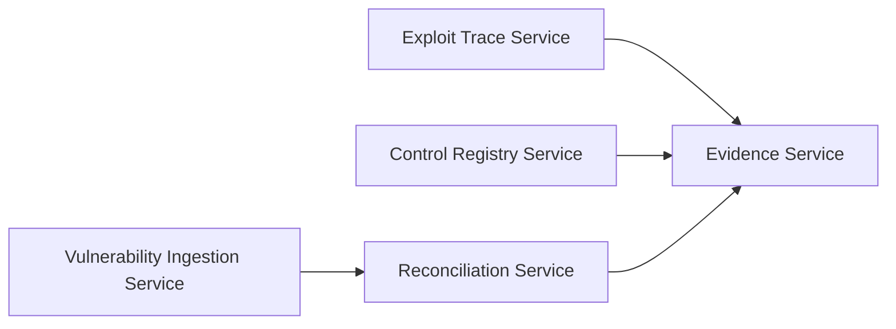

# bigip-icontrol-rce-research

Structured SecDevOps research platform modelling CVE-2021-22986 (F5 BIG-IP iControl REST unauthenticated RCE) as a gRPC-native, OWASP ASVS-aligned program within a disciplined SDLC.

## Purpose
This repository is built for **structured CVE lifecycle governance**, not offensive tooling.
The CVE-2021-22986 PoC flow is treated as input data for ingestion, trace normalization,
and control verification evidence generation.

## Architecture



## SDLC phase map
- Requirements: `sdlc/requirements/threat_model.md`, `sdlc/requirements/asvs_requirements.csv`
- Design: `sdlc/design/architecture.md`, `sdlc/design/control_design.md`
- Implementation: `sdlc/implementation/CHANGELOG.md`
- Verification: `sdlc/verification/test_plan.md`, `sdlc/verification/asvs_test_matrix.csv`
- Release: `sdlc/release/release_checklist.md`

## ASVS / OWASP coverage
See `owasp_control_matrix.csv` for OWASP Top 10 × ASVS control mapping and implementation status.

## How to run
```bash
make proto
make services
make test
make asvs
make evidence-export
```

## Scope boundary
Testing is limited to a local fixture target and serialized test vectors.
No live F5 BIG-IP devices are contacted.

## Attribution
CVE-2021-22986 was discovered by William McVey.
This platform is built for SecDevOps research and control verification purposes.
