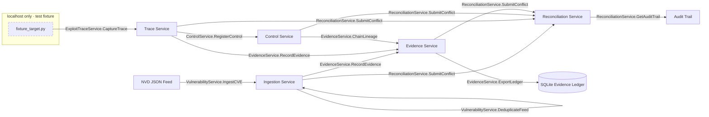

# bigip-icontrol-rce-research

> Structured SecDevOps research platform for CVE-2021-22986 lifecycle governance.
> gRPC-native · OWASP ASVS L2 · Evidence-ledger backed · Fixture-only execution boundary.

bigip-icontrol-rce-research models the CVE-2021-22986 lifecycle as a deterministic software governance pipeline where vulnerability intelligence, exploit-trace fixtures, control verification, and reconciliation history move through typed protobuf contracts so security, platform, and audit teams can inspect one traceable chain from intake to release evidence.


This repository treats CVE-2021-22986 (F5 BIG-IP iControl REST unauthenticated remote code execution, CVSS 9.8) as a structured data and governance problem for engineering teams that must prove control effectiveness in CI/CD. Public PoC material is an ingestion artefact that is parsed into typed protobuf records and replayed as ASVS-linked test vectors. The platform demonstrates control verification, evidence lineage, and SDLC discipline against a critical-severity CVE. The execution boundary is fixed: `services/trace/fixture_target.py` is the only runnable target surface, it binds to localhost, and the workflow never targets live devices.



All inter-service communication is gRPC/protobuf. The fixture target is the only HTTP surface and is bound exclusively to 127.0.0.1.

A full run starts when the ingestion service pulls CVE metadata from the NVD feed, fingerprints each candidate record, deduplicates by CVE and fingerprint, and stores the resulting vulnerability record. The trace service captures exploit interaction against the localhost fixture, extracts injection-relevant fields, and emits trace metadata for control evaluation. The control service maps the trace context to ASVS controls and triggers verification logic. The evidence service writes evidence entries with content hash and lineage references into the ledger. When any field-level conflict appears between incoming and stored records, reconciliation receives the conflict, applies policy, and appends the resulting decision to the audit trail.

## Prerequisites

### System requirements

```text
Python  >= 3.12      # project runtime declared in pyproject.toml
Node.js >= 20.x      # optional JS/TS protobuf stub toolchain compatibility floor
Docker  >= 24.x      # compose workflow baseline
docker-compose >= 2.x
protoc  >= 25.x      # required for proto3 code generation used by make proto
make
```

### Python dependencies

```text
# requirements.txt — runtime
grpcio==1.68.1
grpcio-tools==1.68.1
protobuf==5.29.1
fastapi==0.115.0        # fixture_target.py only
uvicorn==0.32.0         # fixture_target.py only
sqlalchemy==2.0.36      # evidence ledger
pydantic==2.9.2

# requirements-dev.txt — test and tooling
pytest==8.3.4
pytest-asyncio==0.24.0
pytest-cov==6.0.0
ruff==0.8.2
mypy==1.13.0
pip-audit==2.7.3
grpcio-testing==1.68.1
```

### Node dependencies (optional: JS stub generation only)

```json
{
  "devDependencies": {
    "grpc-tools": "1.13.0",
    "protoc-gen-grpc-web": "1.5.0",
    "ts-proto": "2.1.0"
  },
  "scripts": {
    "proto:gen": "make proto-js"
  }
}
```

## Build and run

### Step 1 — Clone and verify

```bash
git clone https://github.com/<org>/bigip-icontrol-rce-research
cd bigip-icontrol-rce-research
make verify-tools
```

### Step 2 — Install Python dependencies

```bash
python -m venv .venv
source .venv/bin/activate        # Windows: .venv\Scripts\activate
pip install -r requirements.txt
pip install -r requirements-dev.txt
```

### Step 3 — Compile protobuf stubs

```bash
make proto
```

`make proto` invokes `protoc` for every `.proto` contract in `proto/` and writes generated Python stubs to `generated/`; run it before service startup and run it again after every `.proto` change.

### Step 4 — Start services

```bash
make services
make services-detach
make services-down
```

| Service              | Port  | Bind      | Protocol |
|----------------------|-------|-----------|----------|
| Ingestion            | 50051 | 0.0.0.0   | gRPC     |
| Trace                | 50052 | 0.0.0.0   | gRPC     |
| Control              | 50053 | 0.0.0.0   | gRPC     |
| Evidence             | 50054 | 0.0.0.0   | gRPC     |
| Reconciliation       | 50055 | 0.0.0.0   | gRPC     |
| fixture_target       | 8080  | 127.0.0.1 | HTTP     |

The fixture uses HTTP by design to emulate the vulnerable surface inside a localhost-only test boundary.

## Testing and verification

### Run all tests

```bash
make test
make test-coverage
```

### Run ASVS control verification only

```bash
make asvs
```

`make asvs` updates `sdlc/verification/asvs_test_matrix.csv` on each run and treats that file as the machine-readable control verification record.

### Run security audit

```bash
make audit
```

`make audit` is a hard gate and exits non-zero if a known vulnerability at CVSS 7.0 or higher exists in the dependency set.

Unit tests validate deterministic protobuf-oriented functions without network or subprocesses. Integration tests execute ingestion and trace workflow components as one pipeline. ASVS tests use `@pytest.mark.asvs("V{n}.{m}.{k}")` mappings tied to control identifiers in `owasp_control_matrix.csv`. Fixture-boundary tests enforce rejection for non-local targets by asserting `target_fixture_url` must match localhost or 127.0.0.0/8.

## OWASP Top 10 / ASVS coverage

`make readme` regenerates this table from `owasp_control_matrix.csv`.

<!-- OWASP_TABLE_START -->
| OWASP Category | ASVS Control ID | Implementation | Test Coverage | Status |
|---|---|---|---|---|
| Broken Access Control | V4.1.2 | trace | V4.1.2 | IMPLEMENTED |
| Cryptographic Failures | V6.2.1 | platform | V6.2.1 | IN_PROGRESS |
| Injection | V5.3.2 | trace | V5.3.2 | IMPLEMENTED |
| Insecure Design | V1.1.1 | architecture | V1.1.1 | IMPLEMENTED |
| Security Misconfiguration | V14.2.3 | ops | V14.2.3 | IMPLEMENTED |
| Vulnerable Components | V1.14.4 | platform | V1.14.4 | IN_PROGRESS |
| Auth Failures | V2.1.1 | trace | V2.1.1 | IMPLEMENTED |
| Software Integrity Failures | V1.9.1 | evidence | V1.9.1 | IMPLEMENTED |
| Logging Failures | V7.1.1 | evidence | V7.1.1 | IMPLEMENTED |
| SSRF | V5.2.7 | trace | V5.2.7 | IMPLEMENTED |
<!-- OWASP_TABLE_END -->

## SDLC artefact map

<!-- SDLC_TABLE_START -->
| Phase | Artefact | Path | Status |
|---|---|---|---|
| Requirements | STRIDE threat model | sdlc/requirements/threat_model.md | Generated |
| Requirements | ASVS requirements | sdlc/requirements/asvs_requirements.csv | Generated |
| Design | Architecture doc | sdlc/design/architecture.md | Generated |
| Design | Control design | sdlc/design/control_design.md | Generated |
| Implementation | Changelog | sdlc/implementation/CHANGELOG.md | Maintained |
| Verification | Test plan | sdlc/verification/test_plan.md | Generated |
| Verification | ASVS test matrix | sdlc/verification/asvs_test_matrix.csv | Generated |
| Release | Release checklist | sdlc/release/release_checklist.md | Generated |
<!-- SDLC_TABLE_END -->

## Evidence gap register

Track unresolved evidence in `evidence_gap_register.csv`. CRITICAL entries block `make release`. HIGH entries produce warnings during `make asvs`. Every row carries owner and due-date fields. The register is append-only through EvidenceService and reconciliation rejects manual edits.

## What this repository does not do

1. It does not execute code against live F5 BIG-IP devices under any configuration.
2. It does not ship, wrap, or republish offensive tooling; the PoC code from CVE-2021-22986 public disclosure exists only as a parsed test vector.
3. It is not a SIEM integration, alert triage platform, or continuous monitoring service.

## Attribution and references

```text
CVE-2021-22986 discovered by William McVey and Andrew Williams,
reported through F5 Security Response Team.

NVD entry:    https://nvd.nist.gov/vuln/detail/CVE-2021-22986
F5 advisory:  https://support.f5.com/csp/article/K03009991
ASVS:         https://owasp.org/www-project-application-security-verification-standard/
OWASP Top 10: https://owasp.org/www-project-top-ten/
```

## Makefile target reference

```text
make proto             Compile .proto → Python stubs (generated/)
make proto-js          Compile .proto → JS/TS stubs (optional)
make services          docker-compose up all services
make services-detach   docker-compose up -d
make services-down     docker-compose down
make test              pytest unit + integration, coverage to terminal
make test-coverage     pytest with htmlcov/ output
make asvs              pytest -m asvs, export asvs_test_matrix.csv
make audit             pip-audit, fail on CVSS ≥ 7.0
make lint              ruff + mypy
make evidence-export   EvidenceService.ExportLedger → sdlc/verification/
make readme            Regenerate OWASP table from owasp_control_matrix.csv
make verify-tools      Check all prerequisites, exit non-zero if missing
make release           Gate check: asvs + audit + gap register + clean tree
make clean             Remove containers, generated stubs, coverage artefacts
```
