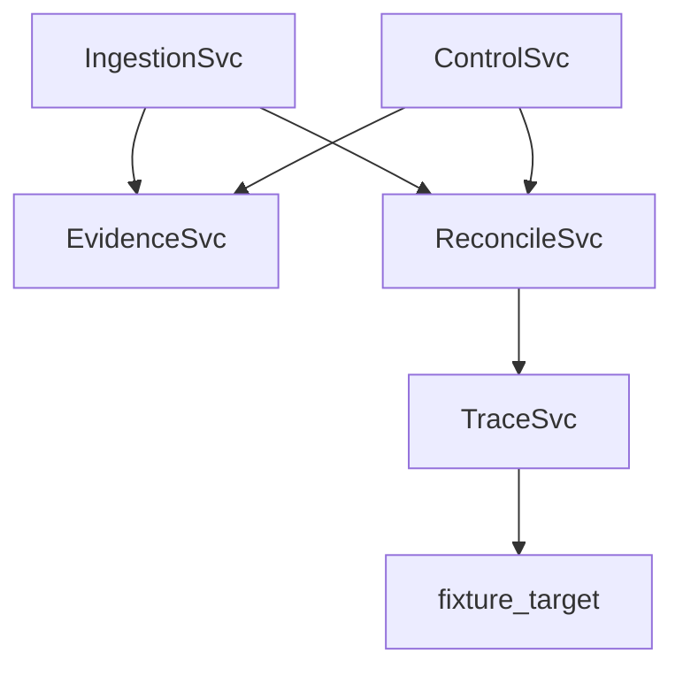

# Architecture Design

## Service Responsibility Table

| Service | Proto Contract | Port | Owns Data | Reads Data |
|---|---|---:|---|---|
| IngestionSvc | `proto/vulnerability.proto` | 50051 | CVE records, fingerprints | Reconciliation conflicts, evidence ACKs |
| TraceSvc | `proto/exploit_trace.proto` | 50052 | ExploitTrace records | Fixture HTTP responses |
| ControlSvc | `proto/control.proto` | 50053 | ASVS control registry | OWASP matrix, evidence ACKs |
| EvidenceSvc | `proto/evidence.proto` | 50054 | Evidence ledger | Records from all services |
| ReconcileSvc | `proto/reconciliation.proto` | 50055 | Conflict records, audit history | Vulnerability conflicts |

## Data Lineage
A raw NVD JSON object is parsed into `VulnerabilityRecord` (`cve_id`, `cvss_score`, `cvss_vector`, `affected_versions`, `ingestion_timestamp`) then fingerprinted (`fingerprint`). Clean ingests emit `EvidenceRecord` entries keyed by `content_hash`. Collisions emit `ConflictRecord` with field-level `ConflictDetail`; resolution creates audit entries and follow-up evidence.

## Deduplication Design
Fingerprint = SHA-256 of `cve_id + "|" + cvss_vector + "|" + "|".join(sorted(affected_versions))`. Duplicate fingerprints are skipped. Matching `cve_id` with differing fingerprints generate a conflict and trigger `SubmitConflict` into reconciliation with field-level deltas.
