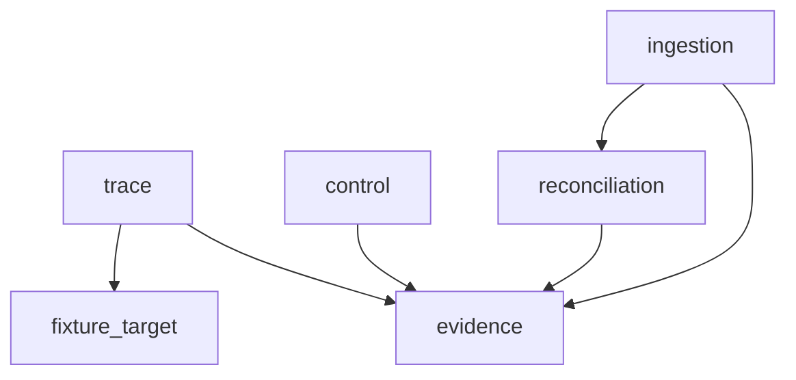

<!--
Repository : bigip-icontrol-rce-research
Path       : sdlc/design/architecture.md
Purpose    : Documents topology, data lineage, and deduplication architecture decisions.
Layer      : sdlc
SDLC Phase : design
ASVS Ref   : V1.1.1
OWASP Ref  : A04
Modified   : 2026-04-11
-->
# 1. Service topology

# 2. Service responsibility table
| service | proto contract | port | data owned | data read from other services |
|---|---|---:|---|---|
| ingestion | vulnerability.v1 | 50051 | VulnerabilityRecord cache | reconciliation outcomes |
| trace | exploit_trace.v1 | 50052 | ExploitTrace cache | evidence ids |
| control | control.v1 | 50053 | ControlRecord registry | ASVS requirements CSV |
| evidence | evidence.v1 | 50054 | evidence_records ledger | lineage references |
| reconciliation | reconciliation.v1 | 50055 | ConflictRecord registry | vulnerability snapshots |

# 3. Data lineage
NVD JSON (`cve.id`, `metrics.cvssMetricV31[0].cvssData.*`, `configurations`) -> `parser.hydrate()` -> `VulnerabilityRecord` -> `dedup.generate_fingerprint()` -> `IngestCVEResponse.fingerprint` -> `EvidenceRecord.content_hash` in ledger export.

# 4. Deduplication design
Fingerprint: SHA-256 of `cve_id|cvss_vector|sorted(affected_versions)`. Collisions route through `detect_conflict`; strategy `LATEST_WINS`, `SOURCE_PRIORITY`, or `MANUAL` selected by reconciliation service configuration.
